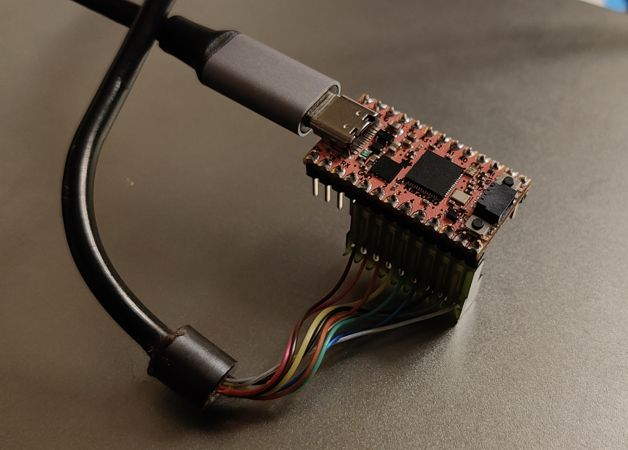
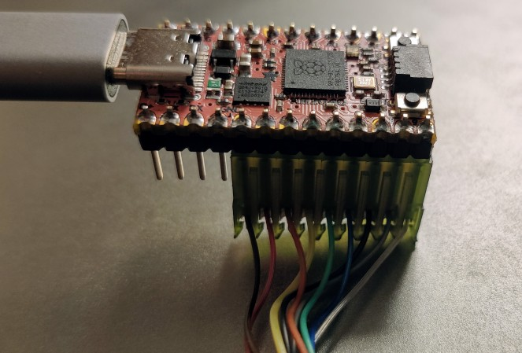

# Intellivision HID controller Firmware

This project is a sample firmware for a [KB2040 Adafruit board](https://learn.adafruit.com/adafruit-kb2040) that makes it possible to use an old Intellivision 1 controller with an emulator running on a PC or any other emulation platform.

## The hardware

The hardware is very simple. You just need a KB2040 and one original Intellivision controller. No soldering, nothing else is required.

Just connect the original connector aligning it to the lower strips, as shown in the pictures. 

The brown wire on the controller connector is Ground and must be connected to pin 5 of the KB2040 board.

## Flashing the firmware

Load the sketch in Arduino IDE. You need to install the "Raspberry PI RP2040 boards" package, use the board manager to install it. Then select the Adafruit KB2040 board, compile the sketch and load it.

Refer to the [Adafruit page](https://learn.adafruit.com/adafruit-kb2040/arduino-ide-setup) on how to do this.

## Configuring the emulator 

Once flashed, the controller appears as a HID device (keyboard). You must map the keys to the Intellivision emulator. With this repository a [Keyboard hack file](hackfile.cfg) for jzintv is provided. Refer to the emulator documentation on how to use it.

## Key Mappings

In the firmware, a very simple mapping is used:

- The keypad is mapped to keys from "0" to "9" digit plus "s" and "r" for clear and enter respectively
- The disk is mapped to keys from "a" to "o", in clockwise direction: "a" for N, "b" for NNE, "c" for NE, and so on, up to "o"  for NNW.
- The side keys are mapped to "x", "y" and "z"

